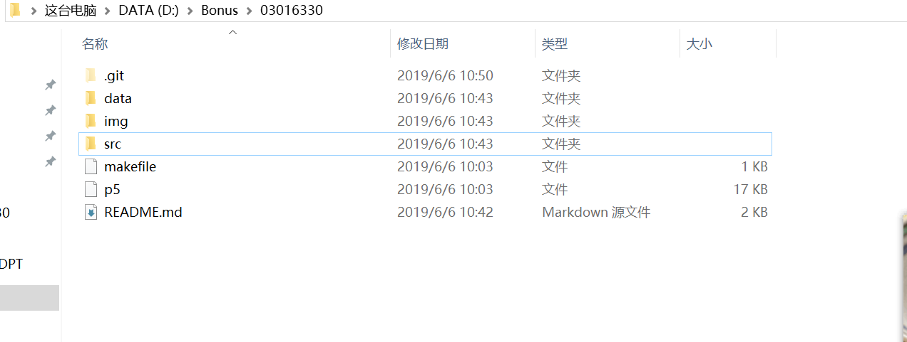
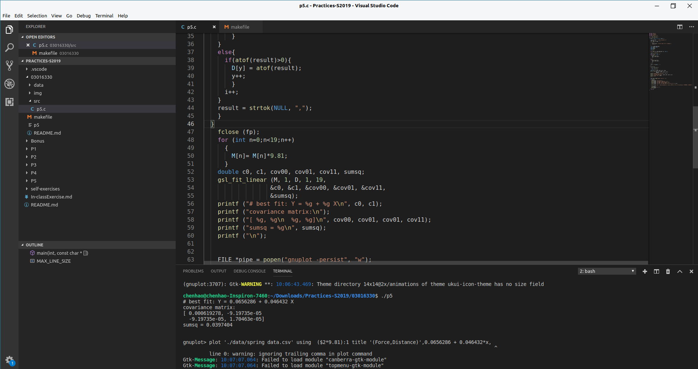

## Bonus

老师，由于学生电脑问题，第一部分作业未能顺利完成，只完成了第二部分。
  
    1、配置Git的开发者信息，然后在本地存储器上建立一个仓库用来存放相关的工程文件。接下来的添加、修改、提交都通过Git的命令来实现。本地的Git仓库如下：
    

    *2建立的远程GitHub仓库的网址为：https://github.com/WANGLIGU0/Bonus
    * 仓库的截图如下：
    

