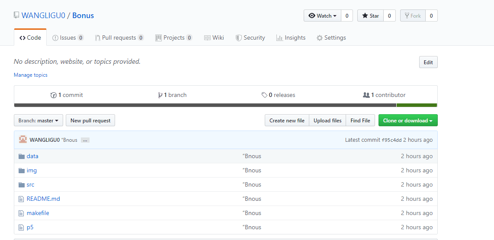

## Bonus

本次的练习主要分为两个部分：第一个部分是学习在Ubuntu下使用Gcc编译器，练习使用GSL进行数据拟合，练习Gnuplot进行绘图；第二个部分是学习使用Git进行版本控制，以及学习以Git为内核的Github的使用；

* 第一部分：
    * Ubuntu是一个基于Debian的免费开源操作系统和Linux发行版。学习适应Ubuntu的使用，可以很好的帮助我们进行一些高端的，复杂的开发，可以使我们跟上主流开发者的脚步。
    * 为了实现对spring_data.csv文件内数据的拟合，我们需要首先读取文件中的数据，并把数据存放为合适的格式。为了方便后面的使用，我们把读取到的文件分别放入D和M数组中。接下来直接使用GSL自带的函数gsl_fit_linear进行数据拟合，拟合得到的结果如下：
    

    * Gnuplot是一个很好用的绘图软件，可以在多种平台上使用，同时符合自由软件的原则。由于我们使用C语言来绘图，所以我们需要用Pipe传递命令和数据。最终绘制的结果如下：
    

* 第二部分：
    * 在任何一个软件开发的过程中，版本控制都是其中一个必不可少的工具。而Git作为其中极为流行且实用的一个工具，受到许许多多的软件开发者的喜爱，而其中很重要的一点，全球最大的开发者聚集地GitHub正是使用Git作为其基础，因此学习Git的使用是十分重要的一个环节。
    * 首先我们要配置Git的开发者信息，然后在本地存储器上建立一个仓库用来存放相关的工程文件。接下来的添加、修改、提交都通过Git的命令来实现。本地的Git仓库如下：
    

    * 为了是自己的工作可以被更多的人了解，方便开发者进行更好的交流，我们可以将自己的工程发布到GitHub上，这样也能够更好的进行开发。所建立的远程GitHub仓库的网址为：https://github.com/1998CHNB/03016330---B；
    * 仓库的截图如下：
    

